# SLM-Lab Benchmarks

Reproducible deep RL algorithm validation across Gymnasium environments (Classic Control, Box2D, MuJoCo, Atari).

---

## Usage

After [installation](../README.md#quick-start), copy `SPEC_FILE` and `SPEC_NAME` from result tables below (Atari uses one shared spec file - see [Phase 4](#phase-4-atari)).

### Running Benchmarks

**Local** - runs on your machine (Classic Control: minutes):
```bash
slm-lab run SPEC_FILE SPEC_NAME train
```

**Remote** - cloud GPU via [dstack](https://dstack.ai), auto-syncs to HuggingFace:
```bash
source .env && slm-lab run-remote --gpu SPEC_FILE SPEC_NAME train -n NAME
```

Remote setup: `cp .env.example .env` then set `HF_TOKEN`. See [README](../README.md#cloud-training-dstack) for dstack config.

### Atari

All games share one spec file (54 tested, 5 hard exploration skipped). Use `-s env=ENV` to substitute. Runs take ~2-3 hours on GPU.

```bash
source .env && slm-lab run-remote --gpu -s env=ALE/Pong-v5 slm_lab/spec/benchmark/ppo/ppo_atari.json ppo_atari train -n pong
```

### Download Results

Trained models and metrics sync to [HuggingFace](https://huggingface.co/datasets/SLM-Lab/benchmark). Pull locally:
```bash
source .env && slm-lab pull SPEC_NAME
slm-lab list  # see available experiments
```

### Benchmark Contribution
To ensure benchmark integrity, follow these steps when adding or updating results:

#### 1. Audit Spec Settings
*   **Before Running**: Ensure `spec.json` matches the **Settings** line defined in each benchmark table.
*   **Example**: `max_frame 3e5 | num_envs 4 | max_session 4 | log_frequency 500`
*   **After Pulling**: Verify the downloaded `spec.json` matches these rules before using the data.

#### 2. Run Benchmark & Commit Specs
*   **Run**: Execute the benchmark locally or remotely using the commands in [Usage](#usage).
*   **Commit Specs**: Always commit the `spec.json` file used for the run to the repo.
*   **Table Entry**: Ensure `BENCHMARKS.md` has an entry with the correct `SPEC_FILE` and `SPEC_NAME`.

#### 3. Record Scores & Plots
*   **Score**: At the **end of the run**, extract `total_reward_ma` from the logs (`trial_metrics`).
*   **Link**: Add the specific HuggingFace folder link to the table.
    *   Format: `[FOLDER_NAME](https://huggingface.co/datasets/SLM-Lab/benchmark-dev/tree/main/data/FOLDER_NAME)`
    *   Example: `[ppo_cartpole_2026...](https://huggingface.co/datasets.../data/ppo_cartpole_2026...)`
*   **Plot**:
    *   Pull data: `slm-lab pull SPEC_NAME`
    *   **Check**: Verify scores in `trial_metrics.json` match logs. Ensure all runs share the same `max_frame`.
    *   Generate plot: Run the plot command with the specific folders listed in the benchmark table.
        ```bash
        slm-lab plot -t "CartPole-v1" -f ppo_cartpole_2025_01_01_120000,dqn_cartpole_2025_01_01_120000,...
        ```
    *   Add plot: `` within the document.

### Environment Settings

Standardized settings for fair comparison. The **Settings** line in each result table shows these values.

| Env Category | num_envs | max_frame | log_frequency | grace_period |
|--------------|----------|-----------|---------------|--------------|
| Classic Control | 4 | 2e5-3e5 | 500 | 1e4 |
| Box2D | 8 | 3e5 | 1000 | 5e4 |
| MuJoCo | 16 | 1e6-10e6 | 1e4 | 1e5-1e6 |
| Atari | 16 | 10e6 | 10000 | 5e5 |

### Hyperparameter Search

When algorithm fails to reach target, run search instead of train:

```bash
slm-lab run SPEC_FILE SPEC_NAME search                                        # local
source .env && slm-lab run-remote --gpu SPEC_FILE SPEC_NAME search -n NAME    # remote
```

| Stage | Mode | Config | Purpose |
|-------|------|--------|---------|
| ASHA | `search` | `max_session=1`, `search_scheduler` enabled | Wide exploration with early stopping |
| Multi | `search` | `max_session=4`, NO `search_scheduler` | Robust validation with averaging |
| Validate | `train` | Final spec | Confirmation run |

> Do not use search result in benchmark results - use final validation run with committed spec.

Search budget: ~3-4 trials per dimension (8 trials = 2-3 dims, 16 = 3-4 dims, 20+ = 5+ dims).

```json
{
  "meta": {
    "max_session": 1, "max_trial": 16,
    "search_resources": {"cpu": 1, "gpu": 0.125},
    "search_scheduler": {"grace_period": 1e5, "reduction_factor": 3}
  },
  "search": {
    "agent.algorithm.gamma__uniform": [0.98, 0.999],
    "agent.algorithm.lam__uniform": [0.9, 0.98],
    "agent.net.optim_spec.lr__loguniform": [1e-4, 1e-3]
  }
}
```


## Progress

| Phase | Category | Envs | REINFORCE | SARSA | DQN | DDQN+PER | A2C | PPO | SAC | Overall |
|-------|----------|------|-----------|-------|-----|----------|-----|-----|-----|---------|
| 1 | Classic Control | 3 | 🔄 | 🔄 | 🔄 | 🔄 | 🔄 | 🔄 | 🔄 | Rerun pending |
| 2 | Box2D | 2 | N/A | N/A | 🔄 | 🔄 | 🔄 | 🔄 | 🔄 | Rerun pending |
| 3 | MuJoCo | 11 | N/A | N/A | N/A | N/A | 🔄 | 🔄 | 🔄 | Rerun pending |
| 4 | Atari | 59 | N/A | N/A | Skip | Skip | Skip | 🔄 | N/A | **54 games** (not in this rerun) |

**Legend**: ✅ Solved | ⚠️ Close (>80%) | 📊 Acceptable | ❌ Failed | 🔄 In progress/Pending | Skip Not started | N/A Not applicable

---

## Results

### Phase 1: Classic Control

#### 1.1 CartPole-v1

**Docs**: [CartPole](https://gymnasium.farama.org/environments/classic_control/cart_pole/) | State: Box(4) | Action: Discrete(2) | Solved reward MA > 400

**Settings**: max_frame 2e5 | num_envs 4 | max_session 4 | log_frequency 500

| Algorithm | Status | MA | SPEC_FILE | SPEC_NAME | HF Repo |
|-----------|--------|-----|-----------|-----------|---------|
| REINFORCE | ✅ | 448.07 | [slm_lab/spec/benchmark/reinforce/reinforce_cartpole.json](../slm_lab/spec/benchmark/reinforce/reinforce_cartpole.json) | reinforce_cartpole | [reinforce_cartpole_2026_01_14_063124](https://huggingface.co/datasets/SLM-Lab/benchmark-dev/tree/main/data/reinforce_cartpole_2026_01_14_063124) |
| SARSA | ✅ | 466.98 | [slm_lab/spec/benchmark/sarsa/sarsa_cartpole.json](../slm_lab/spec/benchmark/sarsa/sarsa_cartpole.json) | sarsa_boltzmann_cartpole | [sarsa_boltzmann_cartpole_2026_01_14_063512](https://huggingface.co/datasets/SLM-Lab/benchmark-dev/tree/main/data/sarsa_boltzmann_cartpole_2026_01_14_063512) |
| DQN | ⚠️ | 278.76 | [slm_lab/spec/benchmark/dqn/dqn_cartpole.json](../slm_lab/spec/benchmark/dqn/dqn_cartpole.json) | dqn_boltzmann_cartpole | [dqn_boltzmann_cartpole_2026_01_13_223449](https://huggingface.co/datasets/SLM-Lab/benchmark-dev/tree/main/data/dqn_boltzmann_cartpole_2026_01_13_223449) |
| DDQN+PER | ✅ | 433.33 | [slm_lab/spec/benchmark/dqn/dqn_cartpole.json](../slm_lab/spec/benchmark/dqn/dqn_cartpole.json) | ddqn_per_boltzmann_cartpole | [ddqn_per_boltzmann_cartpole_2026_01_14_004948](https://huggingface.co/datasets/SLM-Lab/benchmark-dev/tree/main/data/ddqn_per_boltzmann_cartpole_2026_01_14_004948) |
| A2C | ✅ | 419.24 | [slm_lab/spec/benchmark/a2c/a2c_gae_cartpole.json](../slm_lab/spec/benchmark/a2c/a2c_gae_cartpole.json) | a2c_gae_cartpole | [a2c_gae_cartpole_2026_01_13_094324](https://huggingface.co/datasets/SLM-Lab/benchmark-dev/tree/main/data/a2c_gae_cartpole_2026_01_13_094324) |
| PPO | ✅ | 499.19 | [slm_lab/spec/benchmark/ppo/ppo_cartpole.json](../slm_lab/spec/benchmark/ppo/ppo_cartpole.json) | ppo_cartpole | [ppo_cartpole_2026_01_13_094433](https://huggingface.co/datasets/SLM-Lab/benchmark-dev/tree/main/data/ppo_cartpole_2026_01_13_094433) |
| SAC | ⚠️ | 309.10 | [slm_lab/spec/benchmark/sac/sac_cartpole.json](../slm_lab/spec/benchmark/sac/sac_cartpole.json) | sac_cartpole | [sac_cartpole_2026_01_13_094515](https://huggingface.co/datasets/SLM-Lab/benchmark-dev/tree/main/data/sac_cartpole_2026_01_13_094515) |

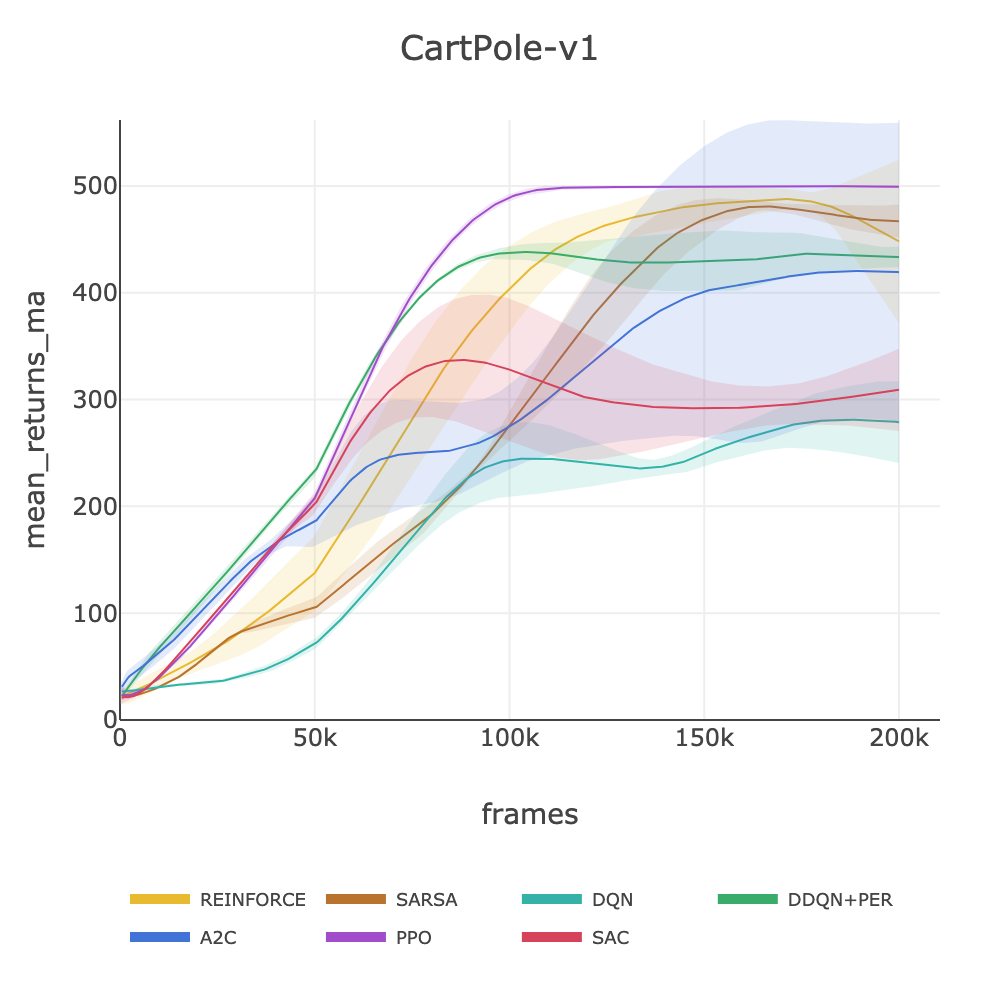

#### 1.2 Acrobot-v1

**Docs**: [Acrobot](https://gymnasium.farama.org/environments/classic_control/acrobot/) | State: Box(6) | Action: Discrete(3) | Solved reward MA > -100

**Settings**: max_frame 3e5 | num_envs 4 | max_session 4 | log_frequency 500

| Algorithm | Status | MA | SPEC_FILE | SPEC_NAME | HF Repo |
|-----------|--------|-----|-----------|-----------|---------|
| DQN | ✅ | -96.79 | [slm_lab/spec/benchmark/dqn/dqn_acrobot.json](../slm_lab/spec/benchmark/dqn/dqn_acrobot.json) | dqn_boltzmann_acrobot | [dqn_boltzmann_acrobot_2026_01_18_102214](https://huggingface.co/datasets/SLM-Lab/benchmark-dev/tree/main/data/dqn_boltzmann_acrobot_2026_01_18_102214) |
| DDQN+PER | ✅ | -83.39 | [slm_lab/spec/benchmark/dqn/ddqn_per_acrobot.json](../slm_lab/spec/benchmark/dqn/ddqn_per_acrobot.json) | ddqn_per_acrobot | [ddqn_per_acrobot_2026_01_13_120506](https://huggingface.co/datasets/SLM-Lab/benchmark-dev/tree/main/data/ddqn_per_acrobot_2026_01_13_120506) |
| A2C | ✅ | -83.70 | [slm_lab/spec/benchmark/a2c/a2c_gae_acrobot.json](../slm_lab/spec/benchmark/a2c/a2c_gae_acrobot.json) | a2c_gae_acrobot | [a2c_gae_acrobot_2026_01_13_113425](https://huggingface.co/datasets/SLM-Lab/benchmark-dev/tree/main/data/a2c_gae_acrobot_2026_01_13_113425) |
| PPO | ✅ | -83.22 | [slm_lab/spec/benchmark/ppo/ppo_acrobot.json](../slm_lab/spec/benchmark/ppo/ppo_acrobot.json) | ppo_acrobot | [ppo_acrobot_2026_01_13_094648](https://huggingface.co/datasets/SLM-Lab/benchmark-dev/tree/main/data/ppo_acrobot_2026_01_13_094648) |
| SAC | ✅ | -95.66 | [slm_lab/spec/benchmark/sac/sac_acrobot.json](../slm_lab/spec/benchmark/sac/sac_acrobot.json) | sac_acrobot | [sac_acrobot_2026_01_13_094654](https://huggingface.co/datasets/SLM-Lab/benchmark-dev/tree/main/data/sac_acrobot_2026_01_13_094654) |

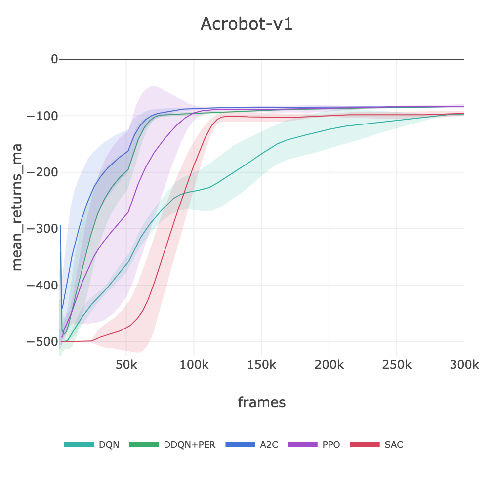

#### 1.3 Pendulum-v1

**Docs**: [Pendulum](https://gymnasium.farama.org/environments/classic_control/pendulum/) | State: Box(3) | Action: Box(1) | Solved reward MA > -200

**Settings**: max_frame 3e5 | num_envs 4 | max_session 4 | log_frequency 500

| Algorithm | Status | MA | SPEC_FILE | SPEC_NAME | HF Repo |
|-----------|--------|-----|-----------|-----------|---------|
| A2C | ⚠️ | -452.28 | [slm_lab/spec/benchmark/a2c/a2c_gae_pendulum.json](../slm_lab/spec/benchmark/a2c/a2c_gae_pendulum.json) | a2c_gae_pendulum | [a2c_gae_pendulum_2026_01_22_221414](https://huggingface.co/datasets/SLM-Lab/benchmark-dev/tree/main/data/a2c_gae_pendulum_2026_01_22_221414) |
| PPO | ✅ | -182.91 | [slm_lab/spec/benchmark/ppo/ppo_pendulum.json](../slm_lab/spec/benchmark/ppo/ppo_pendulum.json) | ppo_pendulum | [ppo_pendulum_2026_01_13_094642](https://huggingface.co/datasets/SLM-Lab/benchmark-dev/tree/main/data/ppo_pendulum_2026_01_13_094642) |
| SAC | ✅ | -149.67 | [slm_lab/spec/benchmark/sac/sac_pendulum.json](../slm_lab/spec/benchmark/sac/sac_pendulum.json) | sac_pendulum | [sac_pendulum_2026_01_13_094801](https://huggingface.co/datasets/SLM-Lab/benchmark-dev/tree/main/data/sac_pendulum_2026_01_13_094801) |

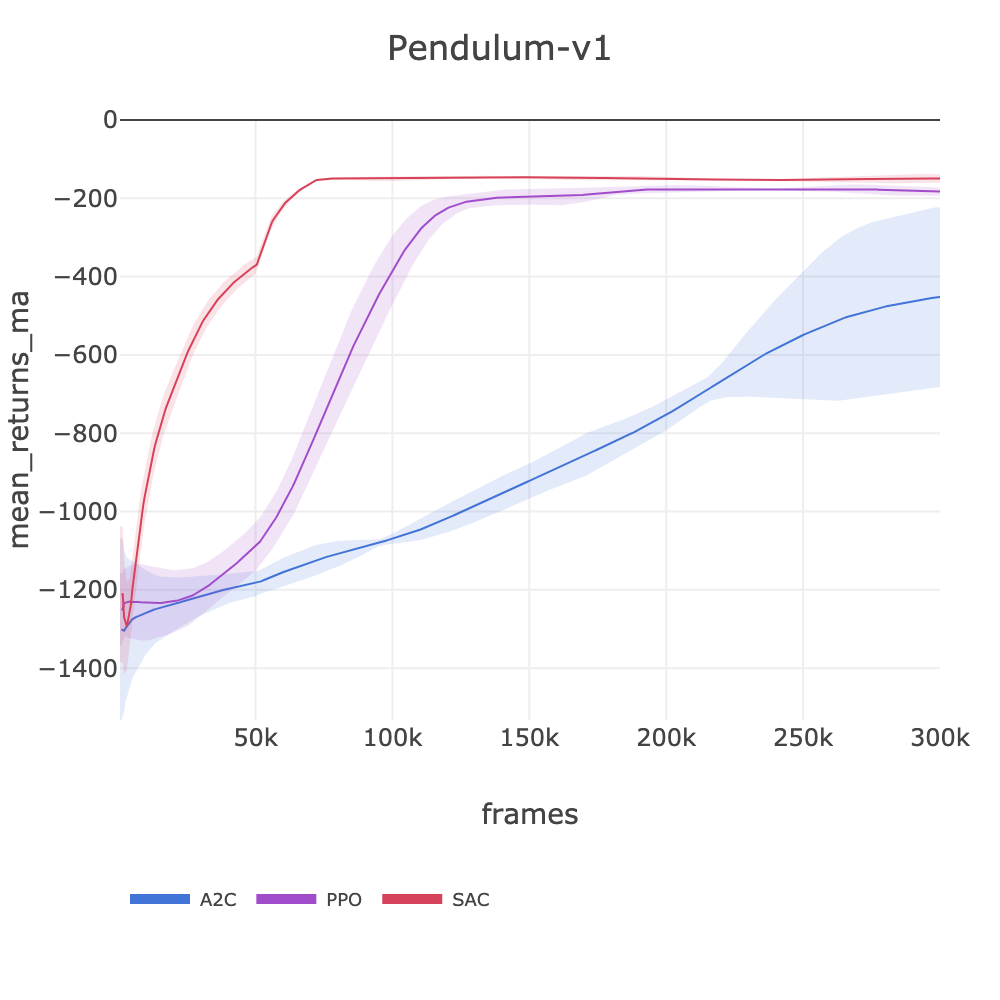

### Phase 2: Box2D

#### 2.1 LunarLander-v3 (Discrete)

**Docs**: [LunarLander](https://gymnasium.farama.org/environments/box2d/lunar_lander/) | State: Box(8) | Action: Discrete(4) | Solved reward MA > 200

**Settings**: max_frame 3e5 | num_envs 8 | max_session 4 | log_frequency 1000

| Algorithm | Status | MA | SPEC_FILE | SPEC_NAME | HF Repo |
|-----------|--------|-----|-----------|-----------|---------|
| DQN | ⚠️ | 182.12 | [slm_lab/spec/benchmark/dqn/dqn_lunar.json](../slm_lab/spec/benchmark/dqn/dqn_lunar.json) | dqn_concat_lunar | [dqn_concat_lunar_2026_01_18_102848](https://huggingface.co/datasets/SLM-Lab/benchmark-dev/tree/main/data/dqn_concat_lunar_2026_01_18_102848) |
| DDQN+PER | ✅ | 263.30 | [slm_lab/spec/benchmark/dqn/ddqn_per_lunar.json](../slm_lab/spec/benchmark/dqn/ddqn_per_lunar.json) | ddqn_per_concat_lunar | [ddqn_per_concat_lunar_2026_01_13_094722](https://huggingface.co/datasets/SLM-Lab/benchmark-dev/tree/main/data/ddqn_per_concat_lunar_2026_01_13_094722) |
| A2C | ❌ | 53.94 | [slm_lab/spec/benchmark/a2c/a2c_gae_lunar.json](../slm_lab/spec/benchmark/a2c/a2c_gae_lunar.json) | a2c_gae_lunar | [a2c_gae_lunar_2026_01_18_102919](https://huggingface.co/datasets/SLM-Lab/benchmark-dev/tree/main/data/a2c_gae_lunar_2026_01_18_102919) |
| PPO | ✅ | 225.99 | [slm_lab/spec/benchmark/ppo/ppo_lunar.json](../slm_lab/spec/benchmark/ppo/ppo_lunar.json) | ppo_lunar | [ppo_lunar_2026_01_18_102921](https://huggingface.co/datasets/SLM-Lab/benchmark-dev/tree/main/data/ppo_lunar_2026_01_18_102921) |
| SAC | ❌ | -71.46 | [slm_lab/spec/benchmark/sac/sac_lunar.json](../slm_lab/spec/benchmark/sac/sac_lunar.json) | sac_lunar | [sac_lunar_2026_01_13_120710](https://huggingface.co/datasets/SLM-Lab/benchmark-dev/tree/main/data/sac_lunar_2026_01_13_120710) |

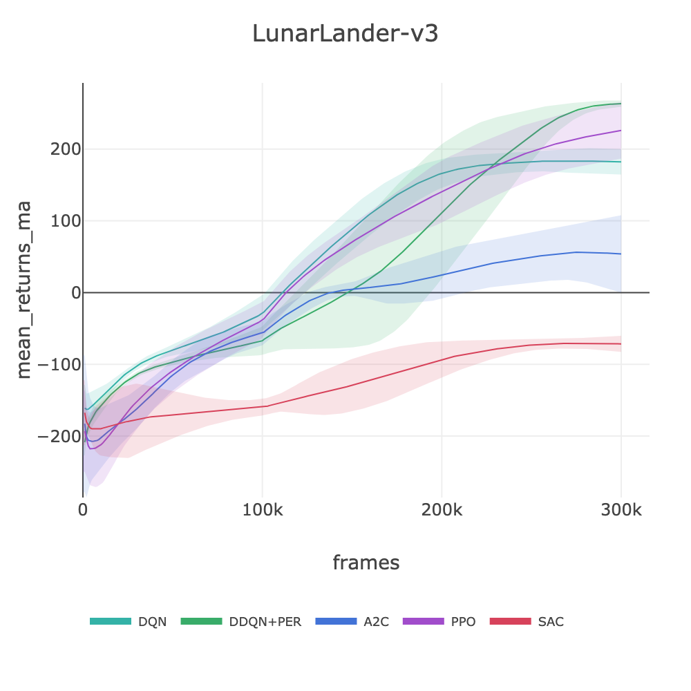

#### 2.2 LunarLander-v3 (Continuous)

**Docs**: [LunarLander](https://gymnasium.farama.org/environments/box2d/lunar_lander/) | State: Box(8) | Action: Box(2) | Solved reward MA > 200

**Settings**: max_frame 3e5 | num_envs 8 | max_session 4 | log_frequency 1000

| Algorithm | Status | MA | SPEC_FILE | SPEC_NAME | HF Repo |
|-----------|--------|-----|-----------|-----------|---------|
| A2C | ❌ | -65.11 | [slm_lab/spec/benchmark/a2c/a2c_gae_lunar.json](../slm_lab/spec/benchmark/a2c/a2c_gae_lunar.json) | a2c_gae_lunar_continuous | [a2c_gae_lunar_continuous_2026_01_13_095842](https://huggingface.co/datasets/SLM-Lab/benchmark-dev/tree/main/data/a2c_gae_lunar_continuous_2026_01_13_095842) |
| PPO | ⚠️ | 190.52 | [slm_lab/spec/benchmark/ppo/ppo_lunar.json](../slm_lab/spec/benchmark/ppo/ppo_lunar.json) | ppo_lunar_continuous | [ppo_lunar_continuous_2026_01_19_080542](https://huggingface.co/datasets/SLM-Lab/benchmark-dev/tree/main/data/ppo_lunar_continuous_2026_01_19_080542) |
| SAC | ⚠️ | 143.03 | [slm_lab/spec/benchmark/sac/sac_lunar.json](../slm_lab/spec/benchmark/sac/sac_lunar.json) | sac_lunar_continuous | [sac_lunar_continuous_2026_01_13_095853](https://huggingface.co/datasets/SLM-Lab/benchmark-dev/tree/main/data/sac_lunar_continuous_2026_01_13_095853) |

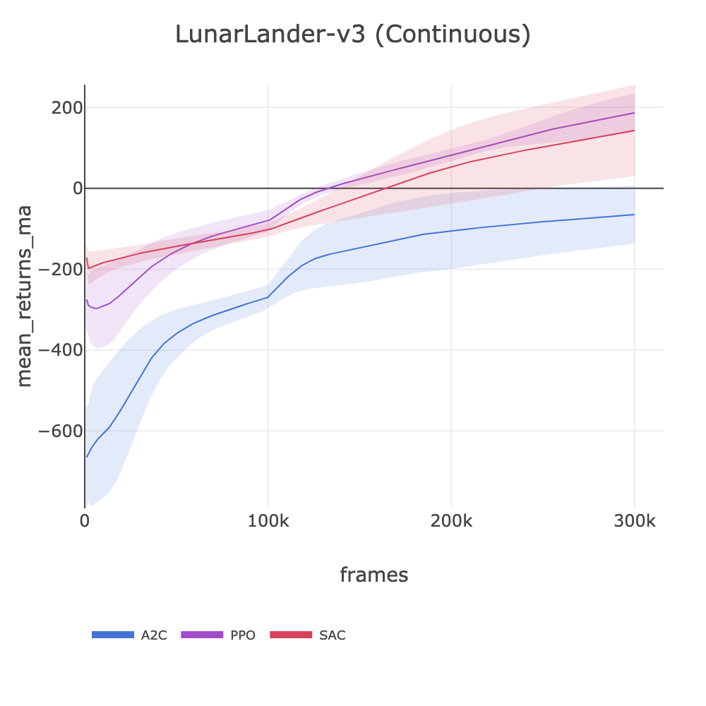

### Phase 3: MuJoCo

MuJoCo envs use unified specs where possible, with individual specs for edge cases.

**Unified Specs** in [ppo_mujoco.json](../slm_lab/spec/benchmark/ppo/ppo_mujoco.json) - 6 envs:

| SPEC_NAME | gamma | lam | lr | entropy | Envs |
|-----------|-------|-----|-----|---------|------|
| ppo_mujoco | 0.99 | 0.95 | 3e-4 | 0.0 | HalfCheetah, Walker, Humanoid, HumanoidStandup |
| ppo_mujoco_longhorizon | 0.997 | 0.97 | 2e-4 | 0.001 | Reacher, Pusher |

**Individual Specs** - 5 envs:

| Env | SPEC_FILE | Key Differences |
|-----|-----------|-----------------|
| Hopper | ppo_hopper.json | gamma=0.991, lam=0.95, lr=3e-4, entropy=0.005 |
| Swimmer | ppo_swimmer.json | gamma=0.997, lam=0.968, lr=2.2e-4, entropy=0.025, no lr_scheduler |
| Ant | ppo_ant.json | gamma=0.988, lam=0.928, lr=1.5e-4 |
| IP | ppo_inverted_pendulum.json | AdamW+LinearToZero, lr=5.7e-4, time_horizon=32, minibatch=32, clip=0.4, val_loss_coef=0.2 |
| IDP | ppo_inverted_double_pendulum.json | AdamW+LinearToZero, lr=1.55e-4, time_horizon=128, minibatch=128, clip=0.4, val_loss_coef=0.7 |

**Algorithm: PPO** (all specs):
- **Network**: MLP [256,256] tanh, orthogonal init, normalize=true, clip_grad_val=0.5
- **Hyperparams**: AdamW optimizer, minibatch_size=64, training_epoch=10, time_horizon=2048, clip_eps=0.2 (IP/IDP use different settings)

**Reproduce**: Copy values from table below.

For **unified specs** (ppo_mujoco.json), use `-s env=` and `-s max_frame=`:
```bash
source .env && slm-lab run-remote --gpu -s env=ENV -s max_frame=MAX_FRAME \
  slm_lab/spec/benchmark/ppo/ppo_mujoco.json SPEC_NAME train -n NAME
```

For **individual specs**, env is hardcoded but use `-s max_frame=`:
```bash
source .env && slm-lab run-remote --gpu -s max_frame=MAX_FRAME \
  slm_lab/spec/benchmark/ppo/SPEC_FILE SPEC_NAME train -n NAME
```

| ENV | MAX_FRAME | SPEC_FILE | SPEC_NAME | target |
|-----|-----------|-----------|-----------|--------|
| HalfCheetah-v5 | 10e6 | ppo_mujoco.json | ppo_mujoco | 5000 |
| Walker2d-v5 | 10e6 | ppo_mujoco.json | ppo_mujoco | 3500 |
| Humanoid-v5 | 10e6 | ppo_mujoco.json | ppo_mujoco | 700 |
| HumanoidStandup-v5 | 4e6 | ppo_mujoco.json | ppo_mujoco | 100000 |
| Hopper-v5 | 4e6 | ppo_hopper.json | ppo_hopper | 2000 |
| Reacher-v5 | 4e6 | ppo_mujoco.json | ppo_mujoco_longhorizon | -5 |
| Pusher-v5 | 4e6 | ppo_mujoco.json | ppo_mujoco_longhorizon | -40 |
| Swimmer-v5 | 4e6 | ppo_swimmer.json | ppo_swimmer | 300 |
| Ant-v5 | 10e6 | ppo_ant.json | ppo_ant | 2000 |
| InvertedPendulum-v5 | 4e6 | ppo_inverted_pendulum.json | ppo_inverted_pendulum | 1000 |
| InvertedDoublePendulum-v5 | 10e6 | ppo_inverted_double_pendulum.json | ppo_inverted_double_pendulum | 9000 |

#### 3.1 Hopper-v5

**Docs**: [Hopper](https://gymnasium.farama.org/environments/mujoco/hopper/) | State: Box(11) | Action: Box(3) | Solved reward MA > 2000

**Settings**: max_frame 4e6 | num_envs 16 | max_session 4 | log_frequency 1e4

| Algorithm | Status | MA | SPEC_FILE | SPEC_NAME | HF Repo |
|-----------|--------|-----|-----------|-----------|---------|
| A2C | - | - | - | - | |
| PPO | ⚠️ | 1882.51 | [slm_lab/spec/benchmark/ppo/ppo_hopper.json](../slm_lab/spec/benchmark/ppo/ppo_hopper.json) | ppo_hopper | [ppo_hopper_2026_01_27_013148](https://huggingface.co/datasets/SLM-Lab/benchmark-dev/tree/main/data/ppo_hopper_2026_01_27_013148) |
| SAC | - | - | [slm_lab/spec/benchmark/sac/sac_hopper.json](../slm_lab/spec/benchmark/sac/sac_hopper.json) | sac_hopper | |

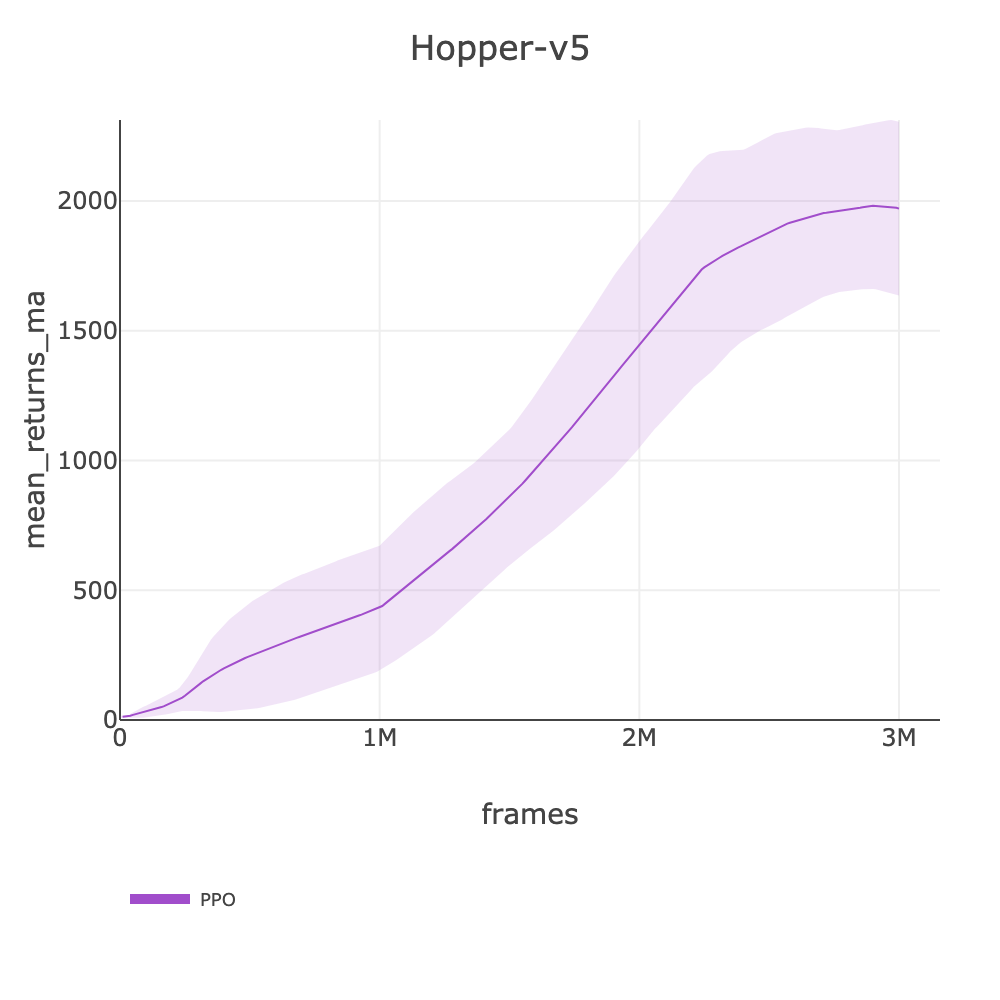

#### 3.2 HalfCheetah-v5

**Docs**: [HalfCheetah](https://gymnasium.farama.org/environments/mujoco/half_cheetah/) | State: Box(17) | Action: Box(6) | Solved reward MA > 5000

**Settings**: max_frame 10e6 | num_envs 16 | max_session 4 | log_frequency 1e4

| Algorithm | Status | MA | SPEC_FILE | SPEC_NAME | HF Repo |
|-----------|--------|-----|-----------|-----------|---------|
| A2C | - | - | - | - | |
| PPO | ✅ | 6032.34 | [slm_lab/spec/benchmark/ppo/ppo_mujoco.json](../slm_lab/spec/benchmark/ppo/ppo_mujoco.json) | ppo_mujoco | [ppo_mujoco_halfcheetah_2026_01_24_103910](https://huggingface.co/datasets/SLM-Lab/benchmark-dev/tree/main/data/ppo_mujoco_halfcheetah_2026_01_24_103910) |
| SAC | - | - | [slm_lab/spec/benchmark/sac/sac_halfcheetah.json](../slm_lab/spec/benchmark/sac/sac_halfcheetah.json) | sac_halfcheetah | |

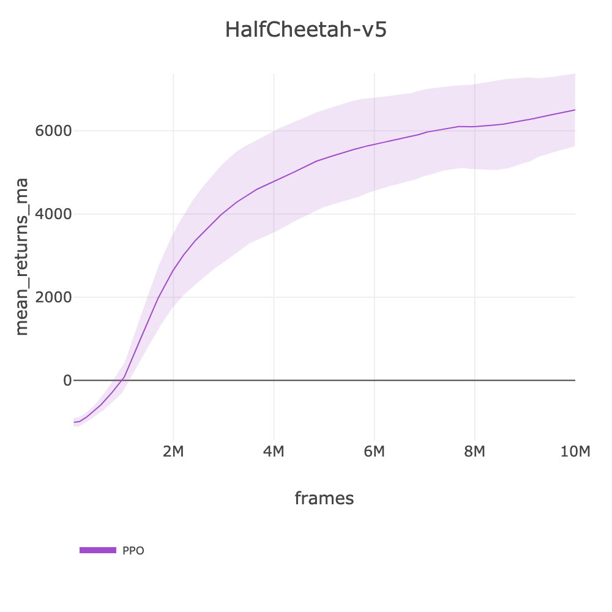

#### 3.3 Walker2d-v5

**Docs**: [Walker2d](https://gymnasium.farama.org/environments/mujoco/walker2d/) | State: Box(17) | Action: Box(6) | Solved reward MA > 3500

**Settings**: max_frame 10e6 | num_envs 16 | max_session 4 | log_frequency 1e4

| Algorithm | Status | MA | SPEC_FILE | SPEC_NAME | HF Repo |
|-----------|--------|-----|-----------|-----------|---------|
| A2C | - | - | - | - | |
| PPO | ✅ | 5130.70 | [slm_lab/spec/benchmark/ppo/ppo_mujoco.json](../slm_lab/spec/benchmark/ppo/ppo_mujoco.json) | ppo_mujoco | [ppo_mujoco_walker2d_2026_01_24_103947](https://huggingface.co/datasets/SLM-Lab/benchmark-dev/tree/main/data/ppo_mujoco_walker2d_2026_01_24_103947) |
| SAC | - | - | [slm_lab/spec/benchmark/sac/sac_walker2d.json](../slm_lab/spec/benchmark/sac/sac_walker2d.json) | sac_walker2d | |

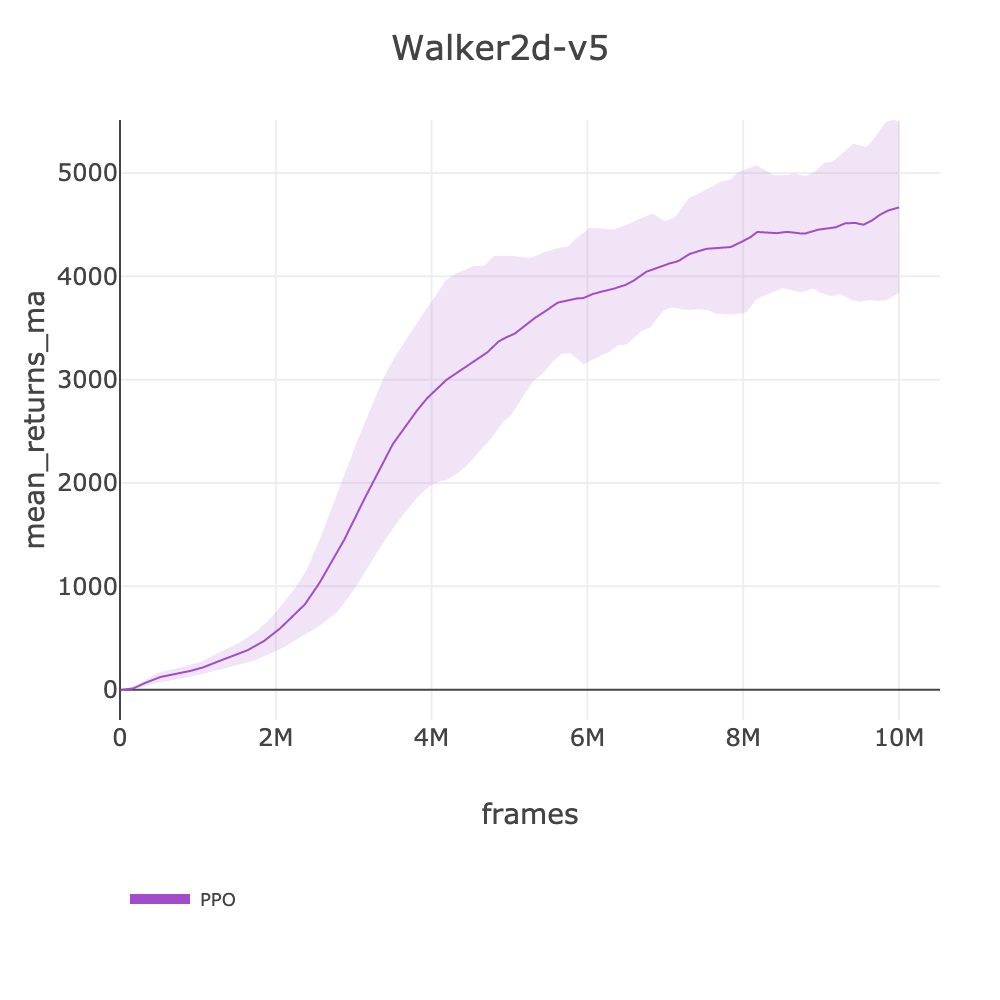

#### 3.4 Ant-v5

**Docs**: [Ant](https://gymnasium.farama.org/environments/mujoco/ant/) | State: Box(105) | Action: Box(8) | Solved reward MA > 2000

**Settings**: max_frame 10e6 | num_envs 16 | max_session 4 | log_frequency 1e4

| Algorithm | Status | MA | SPEC_FILE | SPEC_NAME | HF Repo |
|-----------|--------|-----|-----------|-----------|---------|
| A2C | - | - | - | - | |
| PPO | ✅ | 3032.60 | [slm_lab/spec/benchmark/ppo/ppo_ant.json](../slm_lab/spec/benchmark/ppo/ppo_ant.json) | ppo_ant | [ppo_ant_2026_01_24_152312](https://huggingface.co/datasets/SLM-Lab/benchmark-dev/tree/main/data/ppo_ant_2026_01_24_152312) |
| SAC | - | - | [slm_lab/spec/benchmark/sac/sac_ant.json](../slm_lab/spec/benchmark/sac/sac_ant.json) | sac_ant | |

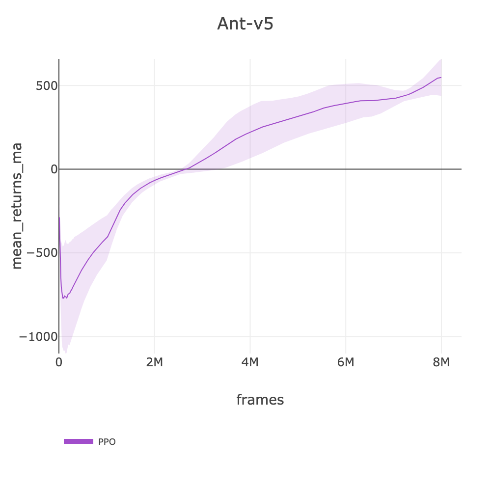

#### 3.5 Swimmer-v5

**Docs**: [Swimmer](https://gymnasium.farama.org/environments/mujoco/swimmer/) | State: Box(8) | Action: Box(2) | Solved reward MA > 300

**Settings**: max_frame 4e6 | num_envs 16 | max_session 4 | log_frequency 1e4

| Algorithm | Status | MA | SPEC_FILE | SPEC_NAME | HF Repo |
|-----------|--------|-----|-----------|-----------|---------|
| A2C | - | - | - | - | |
| PPO | ✅ | 326.49 | [slm_lab/spec/benchmark/ppo/ppo_swimmer.json](../slm_lab/spec/benchmark/ppo/ppo_swimmer.json) | ppo_swimmer | [ppo_swimmer_2026_01_27_040012](https://huggingface.co/datasets/SLM-Lab/benchmark-dev/tree/main/data/ppo_swimmer_2026_01_27_040012) |
| SAC | - | - | [slm_lab/spec/benchmark/sac/sac_swimmer.json](../slm_lab/spec/benchmark/sac/sac_swimmer.json) | sac_swimmer | |

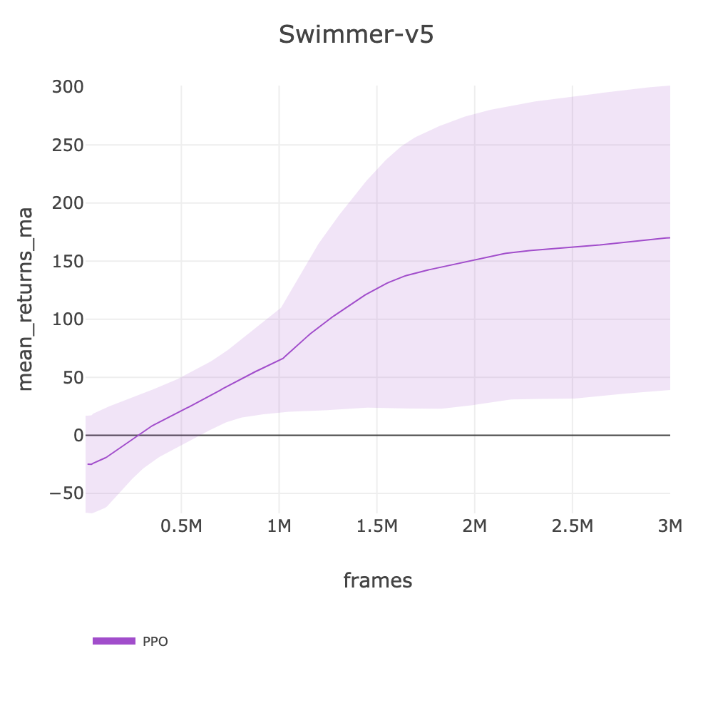

#### 3.6 Reacher-v5

**Docs**: [Reacher](https://gymnasium.farama.org/environments/mujoco/reacher/) | State: Box(11) | Action: Box(2) | Solved reward MA > -10

**Settings**: max_frame 4e6 | num_envs 16 | max_session 4 | log_frequency 1e4

| Algorithm | Status | MA | SPEC_FILE | SPEC_NAME | HF Repo |
|-----------|--------|-----|-----------|-----------|---------|
| A2C | - | - | - | - | |
| PPO | ✅ | -5.66 | [slm_lab/spec/benchmark/ppo/ppo_mujoco.json](../slm_lab/spec/benchmark/ppo/ppo_mujoco.json) | ppo_mujoco_longhorizon | [ppo_mujoco_longhorizon_reacher_2026_01_24_131550](https://huggingface.co/datasets/SLM-Lab/benchmark-dev/tree/main/data/ppo_mujoco_longhorizon_reacher_2026_01_24_131550) |
| SAC | - | - | [slm_lab/spec/benchmark/sac/sac_reacher.json](../slm_lab/spec/benchmark/sac/sac_reacher.json) | sac_reacher | |

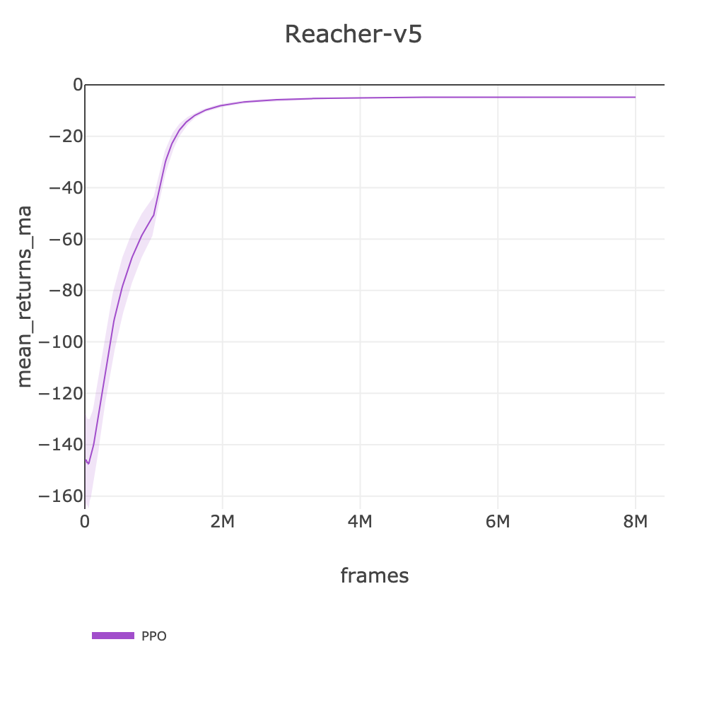

#### 3.7 Pusher-v5

**Docs**: [Pusher](https://gymnasium.farama.org/environments/mujoco/pusher/) | State: Box(23) | Action: Box(7) | Solved reward MA > -40

**Settings**: max_frame 4e6 | num_envs 16 | max_session 4 | log_frequency 1e4

| Algorithm | Status | MA | SPEC_FILE | SPEC_NAME | HF Repo |
|-----------|--------|-----|-----------|-----------|---------|
| A2C | - | - | - | - | |
| PPO | ✅ | -37.35 | [slm_lab/spec/benchmark/ppo/ppo_mujoco.json](../slm_lab/spec/benchmark/ppo/ppo_mujoco.json) | ppo_mujoco_longhorizon | [ppo_mujoco_longhorizon_pusher_2026_01_22_224041](https://huggingface.co/datasets/SLM-Lab/benchmark-dev/tree/main/data/ppo_mujoco_longhorizon_pusher_2026_01_22_224041) |
| SAC | - | - | [slm_lab/spec/benchmark/sac/sac_pusher.json](../slm_lab/spec/benchmark/sac/sac_pusher.json) | sac_pusher | |

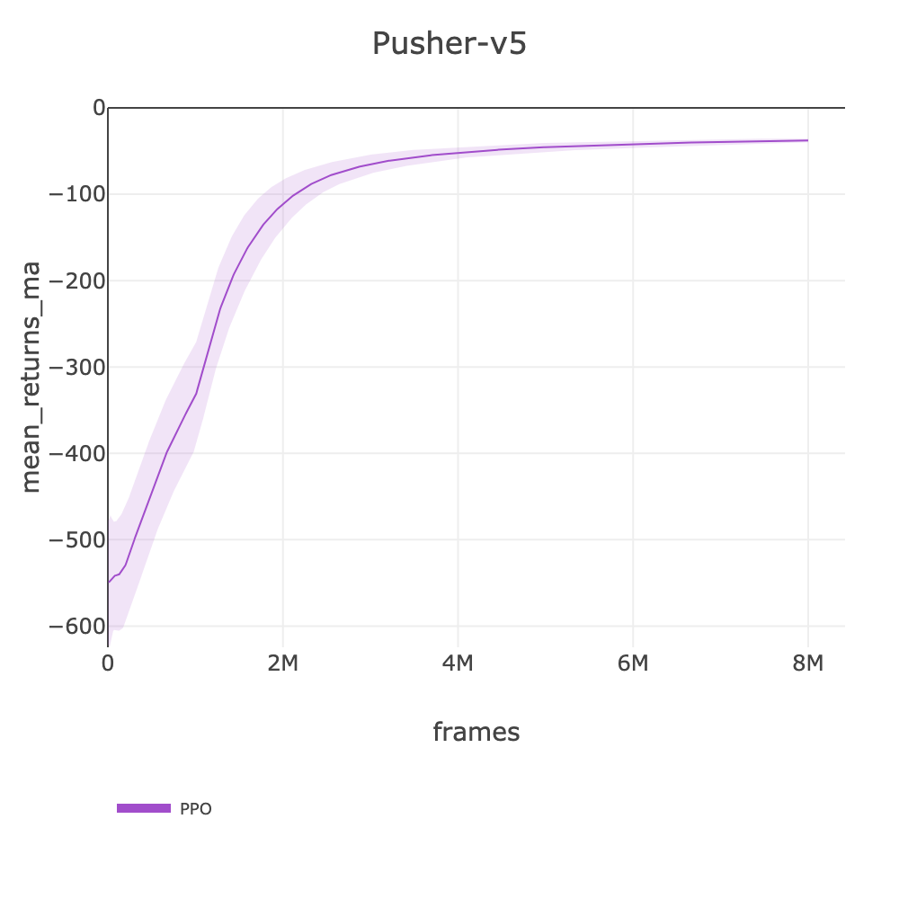

#### 3.8 InvertedPendulum-v5

**Docs**: [InvertedPendulum](https://gymnasium.farama.org/environments/mujoco/inverted_pendulum/) | State: Box(4) | Action: Box(1) | Solved reward MA > 1000

**Settings**: max_frame 4e6 | num_envs 16 | max_session 4 | log_frequency 1e4

| Algorithm | Status | MA | SPEC_FILE | SPEC_NAME | HF Repo |
|-----------|--------|-----|-----------|-----------|---------|
| A2C | - | - | - | - | |
| PPO | ⚠️ | 968.70 | [slm_lab/spec/benchmark/ppo/ppo_inverted_pendulum.json](../slm_lab/spec/benchmark/ppo/ppo_inverted_pendulum.json) | ppo_inverted_pendulum | [ppo_inverted_pendulum_2026_01_26_175008](https://huggingface.co/datasets/SLM-Lab/benchmark-dev/tree/main/data/ppo_inverted_pendulum_2026_01_26_175008) |
| SAC | - | - | [slm_lab/spec/benchmark/sac/sac_inverted_pendulum.json](../slm_lab/spec/benchmark/sac/sac_inverted_pendulum.json) | sac_inverted_pendulum | |

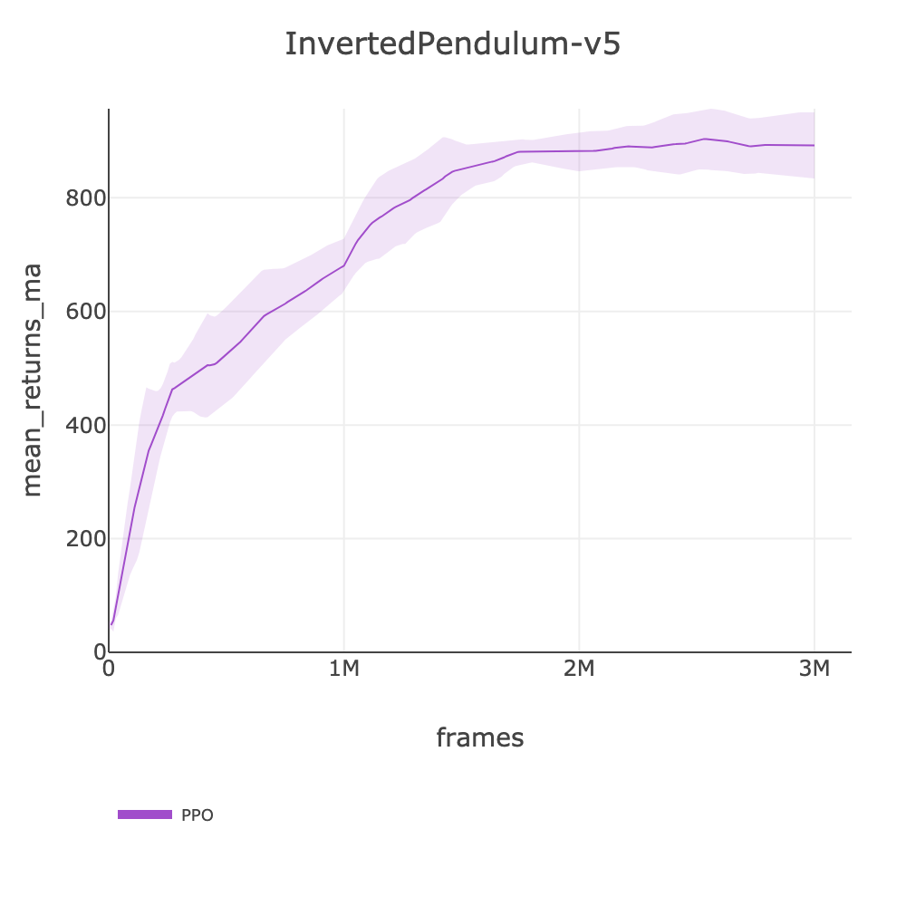

#### 3.9 InvertedDoublePendulum-v5

**Docs**: [InvertedDoublePendulum](https://gymnasium.farama.org/environments/mujoco/inverted_double_pendulum/) | State: Box(11) | Action: Box(1) | Solved reward MA > 9000

**Settings**: max_frame 10e6 | num_envs 16 | max_session 4 | log_frequency 1e4

| Algorithm | Status | MA | SPEC_FILE | SPEC_NAME | HF Repo |
|-----------|--------|-----|-----------|-----------|---------|
| A2C | - | - | - | - | |
| PPO | ⚠️ | 7223.69 | [slm_lab/spec/benchmark/ppo/ppo_inverted_double_pendulum.json](../slm_lab/spec/benchmark/ppo/ppo_inverted_double_pendulum.json) | ppo_inverted_double_pendulum | [ppo_inverted_double_pendulum_2026_01_26_175021](https://huggingface.co/datasets/SLM-Lab/benchmark-dev/tree/main/data/ppo_inverted_double_pendulum_2026_01_26_175021) |
| SAC | - | - | [slm_lab/spec/benchmark/sac/sac_inverted_double_pendulum.json](../slm_lab/spec/benchmark/sac/sac_inverted_double_pendulum.json) | sac_inverted_double_pendulum | |

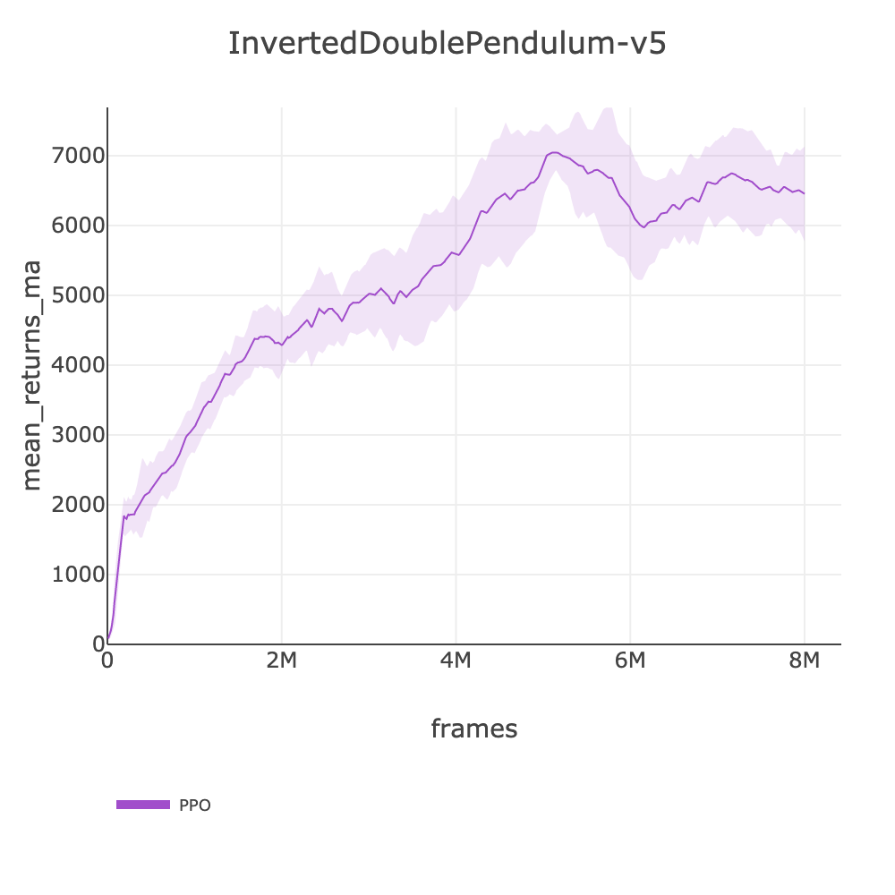

#### 3.10 Humanoid-v5

**Docs**: [Humanoid](https://gymnasium.farama.org/environments/mujoco/humanoid/) | State: Box(376) | Action: Box(17) | Solved reward MA > 700

**Settings**: max_frame 10e6 | num_envs 16 | max_session 4 | log_frequency 1e4

| Algorithm | Status | MA | SPEC_FILE | SPEC_NAME | HF Repo |
|-----------|--------|-----|-----------|-----------|---------|
| A2C | - | - | - | - | |
| PPO | ✅ | 5052.40 | [slm_lab/spec/benchmark/ppo/ppo_mujoco.json](../slm_lab/spec/benchmark/ppo/ppo_mujoco.json) | ppo_mujoco | [ppo_mujoco_humanoid_2026_01_24_103936](https://huggingface.co/datasets/SLM-Lab/benchmark-dev/tree/main/data/ppo_mujoco_humanoid_2026_01_24_103936) |
| SAC | - | - | [slm_lab/spec/benchmark/sac/sac_humanoid.json](../slm_lab/spec/benchmark/sac/sac_humanoid.json) | sac_humanoid | |

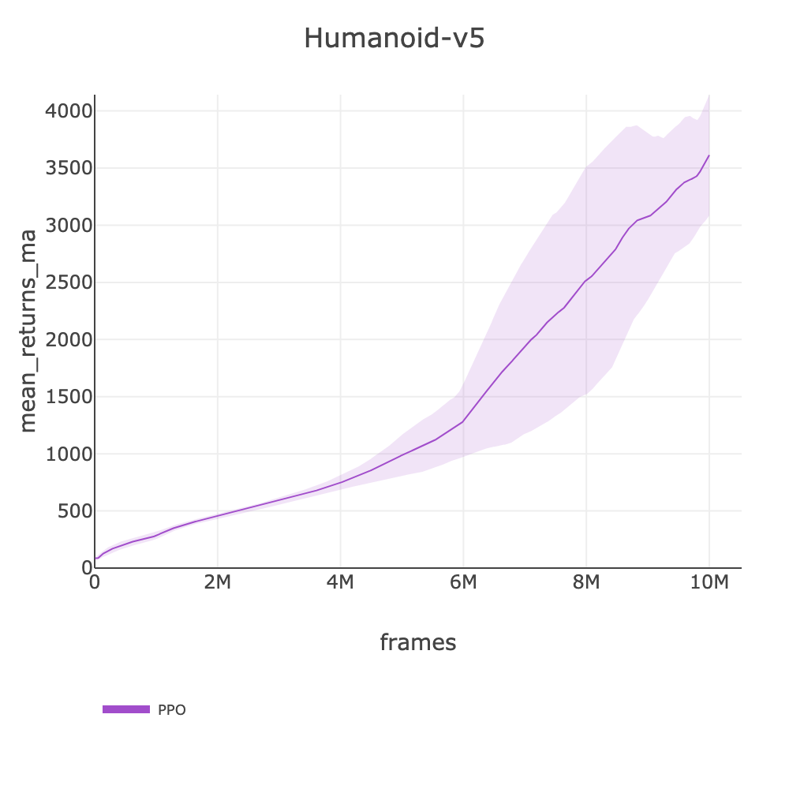

#### 3.11 HumanoidStandup-v5

**Docs**: [HumanoidStandup](https://gymnasium.farama.org/environments/mujoco/humanoid_standup/) | State: Box(376) | Action: Box(17) | Solved reward MA > 100000

**Settings**: max_frame 4e6 | num_envs 16 | max_session 4 | log_frequency 1e4

| Algorithm | Status | MA | SPEC_FILE | SPEC_NAME | HF Repo |
|-----------|--------|-----|-----------|-----------|---------|
| A2C | - | - | - | - | |
| PPO | ✅ | 153541.08 | [slm_lab/spec/benchmark/ppo/ppo_mujoco.json](../slm_lab/spec/benchmark/ppo/ppo_mujoco.json) | ppo_mujoco | [ppo_mujoco_humanoidstandup_2026_01_27_081758](https://huggingface.co/datasets/SLM-Lab/benchmark-dev/tree/main/data/ppo_mujoco_humanoidstandup_2026_01_27_081758) |
| SAC | - | - | [slm_lab/spec/benchmark/sac/sac_humanoid_standup.json](../slm_lab/spec/benchmark/sac/sac_humanoid_standup.json) | sac_humanoid_standup | |

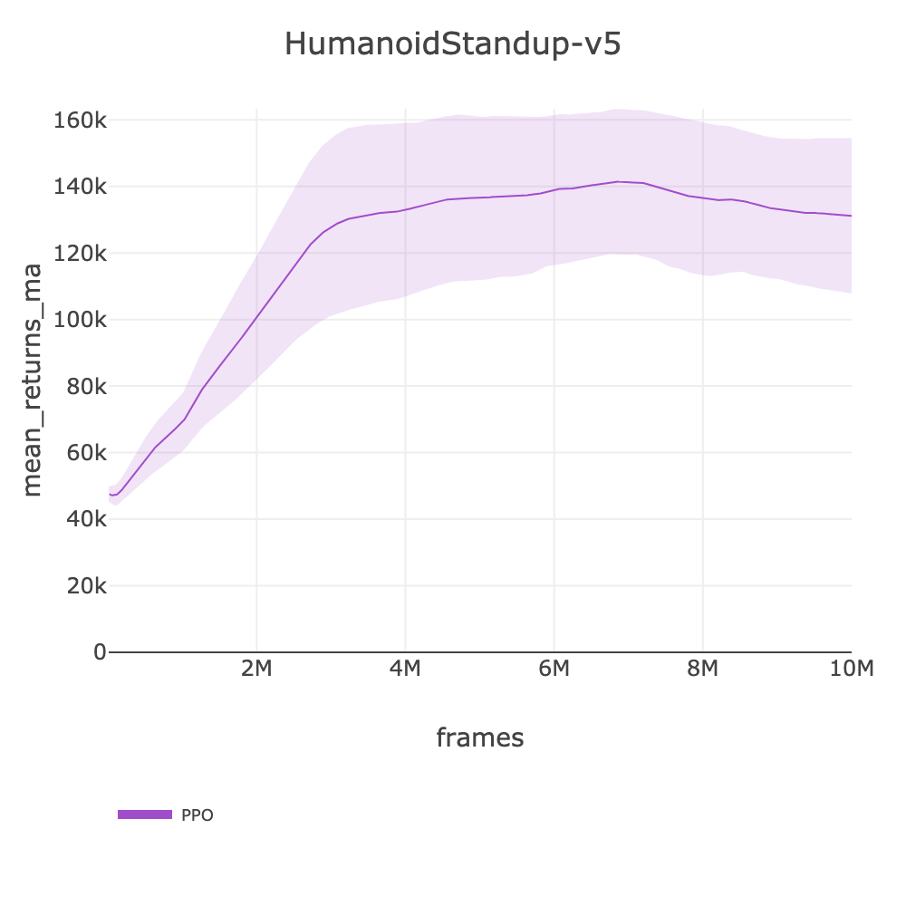

### Phase 4: Atari

**Docs**: [Atari environments](https://ale.farama.org/environments/) | State: Box(84,84,4 after preprocessing) | Action: Discrete(4-18, game-dependent) | Solved: Game-specific thresholds

**Settings**: max_frame 10e6 | num_envs 16 | max_session 4 | log_frequency 10000

**Environment**:
- Gymnasium ALE v5 with `life_loss_info=true`
- v5 is harder than v4 due to sticky actions (default `repeat_action_probability=0.25` vs v4's 0.0), which randomly repeats agent actions to simulate console stochasticity and prevent memorization, following [Machado et al. (2018)](https://arxiv.org/abs/1709.06009) research best practices. See [ALE version history](https://ale.farama.org/environments/#version-history-and-naming-schemes).

**Algorithm: PPO**:
- **Network**: ConvNet [32,64,64] + 512fc (Nature CNN), orthogonal init, normalize=true, clip_grad_val=0.5
- **Hyperparams**: AdamW (lr=2.5e-4, eps=1e-5), minibatch_size=256, time_horizon=128, training_epoch=4, clip_eps=0.1, entropy_coef=0.01

**Lambda Variants**: All use one spec file ([slm_lab/spec/benchmark/ppo/ppo_atari.json](../slm_lab/spec/benchmark/ppo/ppo_atari.json)), differing only in GAE lambda. Lower lambda = bias toward immediate rewards (action games), higher = longer credit horizon (strategic games).

| SPEC_NAME | Lambda | Best for |
|-----------|--------|----------|
| ppo_atari | 0.95 | Long-horizon, strategic games (default) |
| ppo_atari_lam85 | 0.85 | Mixed/moderate games |
| ppo_atari_lam70 | 0.70 | Fast action games |

**Reproduce**: Copy `ENV` from first column, `SPEC_NAME` from column header. All use the same SPEC_FILE:
```bash
source .env && slm-lab run-remote --gpu -s env=ENV \
  slm_lab/spec/benchmark/ppo/ppo_atari.json SPEC_NAME train -n NAME
```

| ENV\SPEC_NAME | ppo_atari | ppo_atari_lam85 | ppo_atari_lam70 |
| -------- | ----------------- | --------------- | --------------- |
| ALE/Adventure-v5 | Skip | Skip | Skip |
| ALE/AirRaid-v5 | **8245** | - | - |
| ALE/Alien-v5 | **1453** | 1353 | 1274 |
| ALE/Amidar-v5 | 574 | **580** | - |
| ALE/Assault-v5 | 4059 | **4293** | 3314 |
| ALE/Asterix-v5 | 2967 | **3482** | - |
| ALE/Asteroids-v5 | 1497 | **1554** | - |
| ALE/Atlantis-v5 | **792886** | 754k | 710k |
| ALE/BankHeist-v5 | **1045** | 1045 | - |
| ALE/BattleZone-v5 | 21270 | **26383** | 13857 |
| ALE/BeamRider-v5 | **2765** | - | - |
| ALE/Berzerk-v5 | **1072** | - | - |
| ALE/Bowling-v5 | **46.45** | - | - |
| ALE/Boxing-v5 | **91.17** | - | - |
| ALE/Breakout-v5 | 191 | 292 | **327** |
| ALE/Carnival-v5 | 3071 | 3013 | **3967** |
| ALE/Centipede-v5 | 3917 | - | **4915** |
| ALE/ChopperCommand-v5 | **5355** | - | - |
| ALE/CrazyClimber-v5 | 107183 | **107370** | - |
| ALE/Defender-v5 | 37162 | - | **51439** |
| ALE/DemonAttack-v5 | 7755 | - | **16558** |
| ALE/DoubleDunk-v5 | **-2.38** | - | - |
| ALE/ElevatorAction-v5 | **5446** | 363 | 3933 |
| ALE/Enduro-v5 | 414 | **898** | 872 |
| ALE/FishingDerby-v5 | 22.80 | **27.10** | - |
| ALE/Freeway-v5 | **31.30** | - | - |
| ALE/Frostbite-v5 | **301** | 275 | 267 |
| ALE/Gopher-v5 | 4172 | - | **6508** |
| ALE/Gravitar-v5 | **599** | 253 | 145 |
| ALE/Hero-v5 | 21052 | **28238** | - |
| ALE/IceHockey-v5 | **-3.93** | -5.58 | -7.36 |
| ALE/Jamesbond-v5 | **662** | - | - |
| ALE/JourneyEscape-v5 | -1582 | **-1252** | -1547 |
| ALE/Kangaroo-v5 | 2623 | **9912** | - |
| ALE/Krull-v5 | **7841** | - | - |
| ALE/KungFuMaster-v5 | 18973 | 28334 | **29068** |
| ALE/MontezumaRevenge-v5 | Skip | Skip | Skip |
| ALE/MsPacman-v5 | 2308 | **2372** | 2297 |
| ALE/NameThisGame-v5 | **5993** | - | - |
| ALE/Phoenix-v5 | 7940 | - | **15659** |
| ALE/Pitfall-v5 | Skip | Skip | Skip |
| ALE/Pong-v5 | 15.01 | **16.91** | 12.85 |
| ALE/Pooyan-v5 | 4704 | - | **5716** |
| ALE/PrivateEye-v5 | Skip | Skip | Skip |
| ALE/Qbert-v5 | **15094** | - | - |
| ALE/Riverraid-v5 | 7319 | **9428** | - |
| ALE/RoadRunner-v5 | 24204 | **37015** | - |
| ALE/Robotank-v5 | **20.07** | 8.24 | 2.59 |
| ALE/Seaquest-v5 | **1796** | - | - |
| ALE/Skiing-v5 | **-19340** | -22980 | -29975 |
| ALE/Solaris-v5 | **2094** | - | - |
| ALE/SpaceInvaders-v5 | **726** | - | - |
| ALE/StarGunner-v5 | 31862 | - | **47495** |
| ALE/Surround-v5 | **-2.52** | - | -6.79 |
| ALE/Tennis-v5 | -7.66 | **-4.41** | - |
| ALE/TimePilot-v5 | **4668** | - | - |
| ALE/Tutankham-v5 | 203 | **217** | - |
| ALE/UpNDown-v5 | **182472** | - | - |
| ALE/Venture-v5 | Skip | Skip | Skip |
| ALE/VideoPinball-v5 | 31385 | - | **56746** |
| ALE/WizardOfWor-v5 | **5814** | 5466 | 4740 |
| ALE/YarsRevenge-v5 | **17120** | - | - |
| ALE/Zaxxon-v5 | **10756** | - | - |

**Legend**: **Bold** = Best score | Skip = Hard exploration | - = Not tested

---

#### Sticky Actions Validation (v5 vs v4-style)

Testing hypothesis that lower scores are due to sticky actions (`repeat_action_probability=0.25` in v5 vs `0.0` in v4/CleanRL).

**Environment**: Same as above, but with `repeat_action_probability=0.0` (matching CleanRL/old v4 behavior)

**Reproduce**: Copy `ENV` from first column:
```bash
source .env && slm-lab run-remote --gpu -s env=ENV \
  slm_lab/spec/benchmark/ppo/ppo_atari.json ppo_atari_nosticky train -n NAME
```

**Results** (Testing games with significant regression):

| ENV | v5 (sticky=0.25) | v4-style (sticky=0.0) | Diff | % Change |
| --- | ---------------- | --------------------- | ---- | -------- |
| ALE/Skiing-v5 | -19340 | - | - | - |
| ALE/Frostbite-v5 | 301 | - | - | - |
| ALE/ElevatorAction-v5 | 5446 | - | - | - |
| ALE/Gravitar-v5 | 599 | - | - | - |
| ALE/WizardOfWor-v5 | 5814 | - | - | - |
| ALE/Alien-v5 | 1453 | - | - | - |
| ALE/KungFuMaster-v5 | 29068 | - | - | - |
| ALE/Atlantis-v5 | 792886 | - | - | - |
| ALE/Pong-v5 | 15.01 | - | - | - |
| ALE/Breakout-v5 | 191 | - | - | - |

